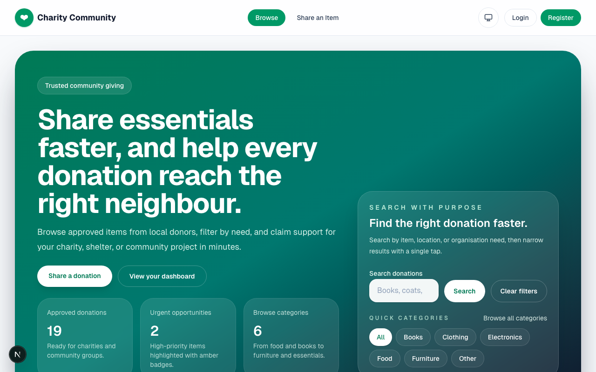
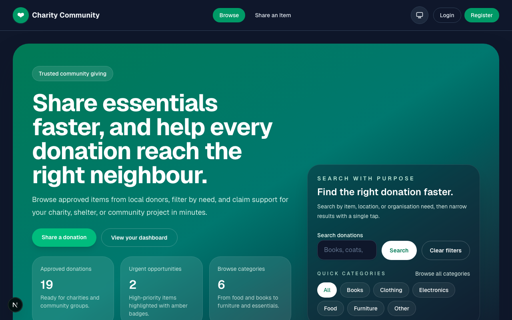
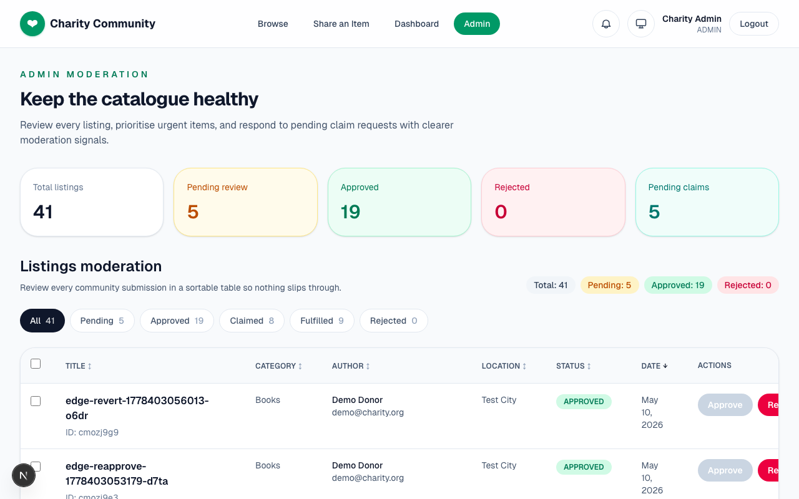
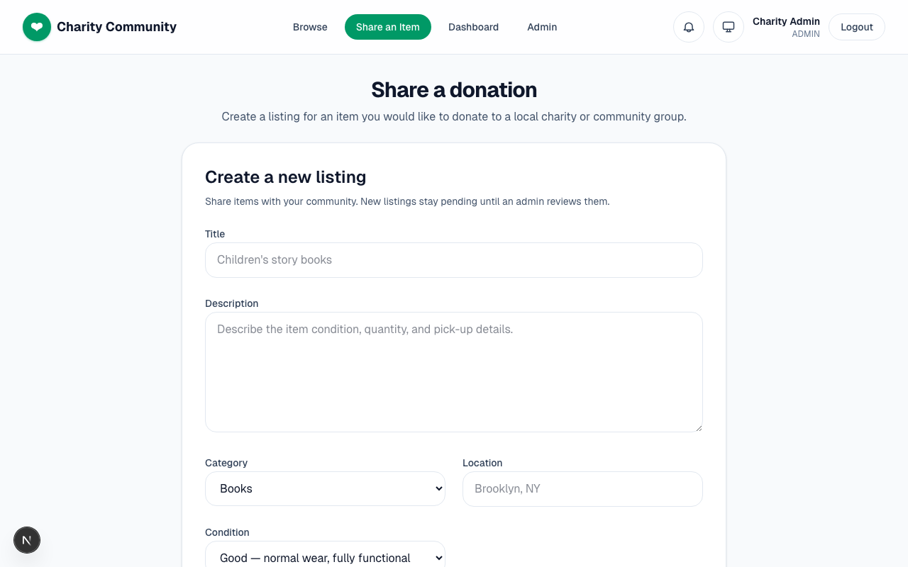
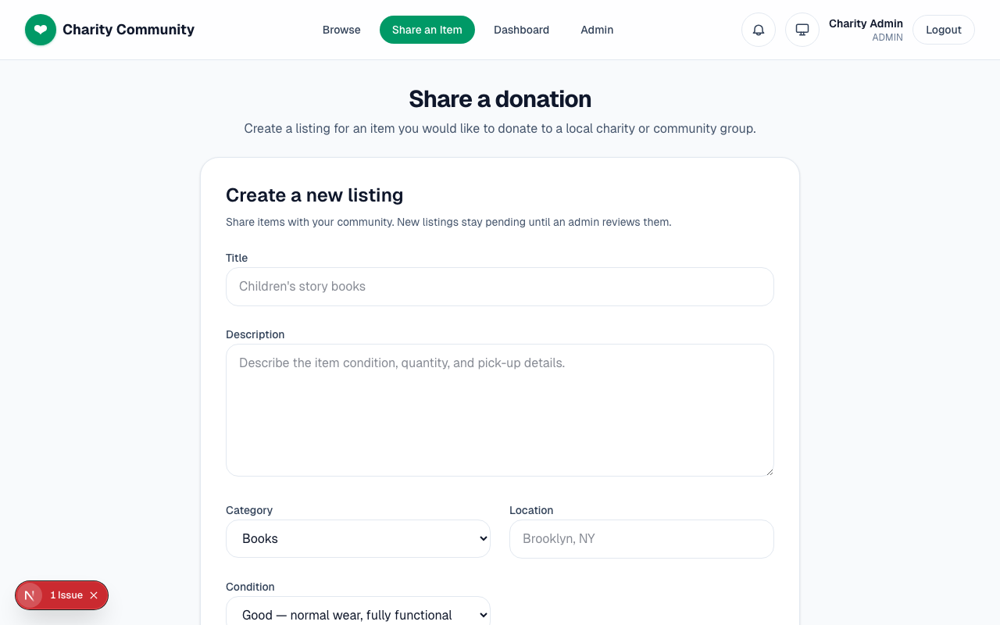
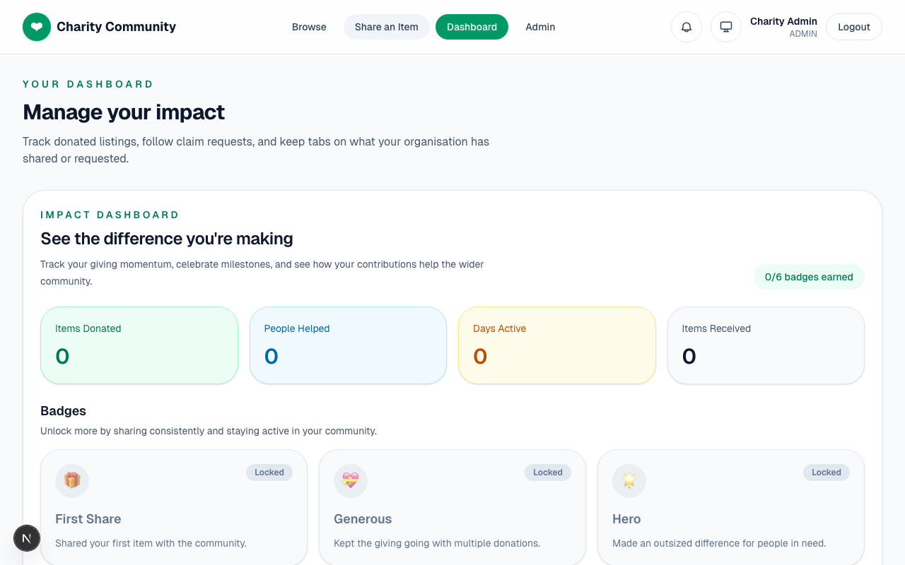
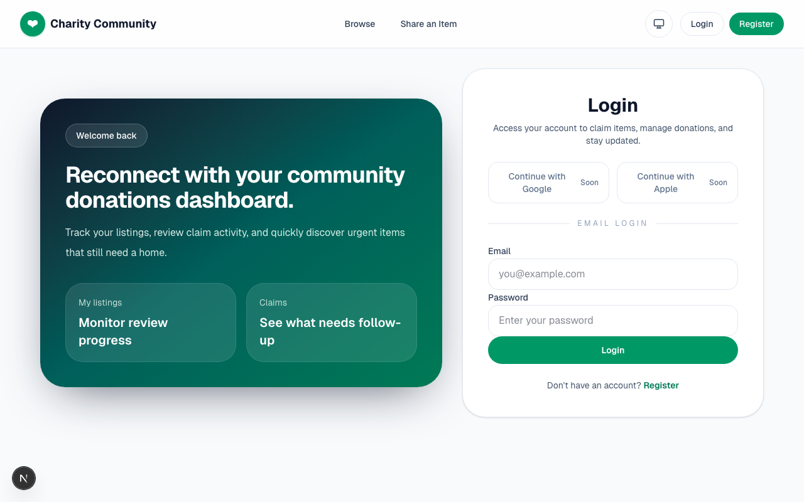
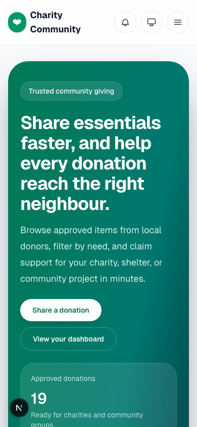

# 🤝 Charity Community Listing System

A full-stack charity community listing platform where users can post items for donation, browse by category and location, claim items they need, and track the full donation lifecycle. Includes admin approval, impact dashboards, reporting, and more.

**🌐 Live Demo:** [charity-community-listing.vercel.app](https://charity-community-listing.vercel.app)

## 📸 Screenshots

<table>
  <tr>
    <td><br/><em>Homepage — Browse listings</em></td>
    <td><br/><em>Dark Mode</em></td>
  </tr>
  <tr>
    <td><br/><em>Admin Panel — Approve/Reject listings</em></td>
    <td><br/><em>Create Listing — With image upload & tags</em></td>
  </tr>
  <tr>
    <td><br/><em>Listing Detail — Claim & messaging</em></td>
    <td><br/><em>Dashboard — Impact stats & badges</em></td>
  </tr>
  <tr>
    <td><br/><em>Login Page</em></td>
    <td><br/><em>Mobile Responsive</em></td>
  </tr>
</table>

## ✨ Features

### Core
- **📸 Image Upload** — Upload images for listings (JPEG, PNG, WebP, GIF, up to 5MB)
- **📂 Categories** — Organize listings by type (Food, Clothing, Electronics, Furniture, Books, Toys, Health, Other)
- **🏷️ Tags** — Add custom tags for better discoverability
- **📍 Location** — Add location info to help nearby community members
- **🔍 Search & Filter** — Search by keyword, filter by category/location/condition with debounced input
- **🙋 Claim System** — Users can claim items with a message to the donor
- **🔐 User Authentication** — Register/login with email & password (bcrypt hashed)
- **👨‍💼 Admin Panel** — Approve or reject listings before they go public
- **🌗 Dark Mode** — Full dark/light theme toggle

### Claim Lifecycle
- **Giver-Selects Model** — Donors review all claims and choose who to give to
- **💬 Claim Messaging** — Chat between donor and claimer (up to 5 messages per claim)
- **📅 Pickup Scheduling** — Set a pickup date/time when approving a claim
- **✅ Fulfillment Tracking** — Mark items as fulfilled once handed over
- **🙏 Gratitude Notes** — Claimers can leave thank-you notes after receiving items

### Community & Safety
- **🏆 Impact Dashboard** — Track your donation stats and earn badges (First Donation, Generous Giver, Community Hero, etc.)
- **🔖 Condition Badges** — Items labeled as New, Like New, Good, or Fair
- **🚩 Report System** — Flag inappropriate listings (Spam, Inappropriate, Scam)
- **⏰ Auto-Expiry** — Listings older than 30 days are automatically hidden
- **🔔 Notifications** — Real-time alerts for claim updates, approvals, and more
- **⏱️ Relative Timestamps** — "2 hours ago" style display with auto-refresh

## 🛠 Tech Stack

| Layer | Technology |
|-------|-----------|
| Framework | Next.js 16 (App Router) |
| Language | TypeScript |
| Database | Prisma ORM + SQLite (local) / PostgreSQL (production) |
| Auth | NextAuth v5 (Credentials) |
| Styling | Tailwind CSS v4 |
| Validation | Zod |
| Testing | Jest + Playwright |
| Hosting | Vercel (with Neon Postgres + Vercel Blob) |
| CI/CD | GitHub Actions |

## 🚀 Quick Start

```bash
# Clone the repo
git clone https://github.com/sirhafizho/charity-community-listing.git
cd charity-community-listing

# Install dependencies
npm install

# Set up environment
cp .env.example .env

# Push database schema & seed
npx prisma db push
npm run prisma:seed

# Start development server
npm run dev
```

Open [http://localhost:3000](http://localhost:3000)

## 🔑 Default Accounts

| Role | Email | Password |
|------|-------|----------|
| Admin | admin@charity.org | admin123 |
| Donor | demo@charity.org | donor123 |
| Member | member@charity.org | community123 |

## 📁 Project Structure

```
src/
├── app/
│   ├── api/
│   │   ├── auth/           # Registration & NextAuth handlers
│   │   ├── listings/       # Listings CRUD + detail
│   │   ├── categories/     # Category management
│   │   ├── claims/         # Claim system + messages + gratitude
│   │   ├── reports/        # Report listing system
│   │   ├── notifications/  # User notifications
│   │   ├── users/me/       # Impact stats + badges
│   │   ├── upload/         # Image upload (local + Vercel Blob)
│   │   └── admin/          # Admin approval endpoints
│   ├── dashboard/          # User dashboard
│   ├── listings/           # Browse, detail, create pages
│   ├── login/              # Login page
│   └── register/           # Registration page
├── components/
│   ├── admin/              # Admin dashboard
│   ├── claims/             # ClaimActions, MessageThread, GratitudeForm
│   ├── dashboard/          # UserDashboard, ImpactDashboard
│   ├── forms/              # CreateListingForm
│   ├── ConditionBadge.tsx   # Item condition display
│   ├── RelativeTime.tsx     # "X ago" timestamps
│   ├── ReportButton.tsx     # Report modal
│   └── ListingCard.tsx      # Listing card with badges
├── lib/                    # Utilities (prisma, auth, validation, rate-limit)
└── types/                  # TypeScript type definitions

e2e/                        # Playwright E2E tests
__tests__/                  # Jest unit & integration tests
scripts/                    # Build & deployment scripts
```

## 🧪 Testing

```bash
# Unit tests
npm test

# Unit tests with coverage
npm test -- --coverage

# E2E tests (requires dev server)
npx playwright test

# E2E with UI
npx playwright test --ui
```

**Test Coverage:** 148 total tests
- **62 unit tests** — API routes, validations, edge cases
- **86 E2E tests** — Full browser flows including registration, login, listing creation, claim lifecycle, admin approval, state machine edge cases, reports, impact dashboard, dark mode, search/filter, and more

## 📡 API Endpoints

| Method | Endpoint | Auth | Description |
|--------|----------|------|-------------|
| POST | /api/auth/register | ❌ | Register new user |
| GET | /api/categories | ❌ | List all categories |
| GET | /api/listings | ❌ | List approved listings (search, filter, paginate) |
| GET | /api/listings/:id | ❌ | Get listing detail with claims |
| POST | /api/listings | ✅ | Create new listing |
| PUT | /api/listings/:id | ✅ | Update own listing |
| DELETE | /api/listings/:id | ✅ | Delete own listing |
| POST | /api/claims | ✅ | Claim a listing |
| PUT | /api/claims/:id | ✅ | Approve/reject/fulfill claim |
| DELETE | /api/claims/:id | ✅ | Withdraw claim |
| POST | /api/claims/:id/messages | ✅ | Send message on a claim |
| GET | /api/claims/:id/messages | ✅ | Get claim message thread |
| POST | /api/claims/:id/gratitude | ✅ | Leave a gratitude note |
| POST | /api/reports | ✅ | Report a listing |
| GET | /api/reports | 🔒 | List reports (admin) |
| PUT | /api/reports/:id | 🔒 | Review/dismiss report (admin) |
| GET | /api/users/me/impact | ✅ | Get impact stats & badges |
| GET | /api/notifications | ✅ | Get user notifications |
| PUT | /api/notifications/:id | ✅ | Mark notification as read |
| POST | /api/upload | ✅ | Upload image |
| GET | /api/admin/listings | 🔒 | All listings (admin) |
| PUT | /api/admin/listings/:id | 🔒 | Approve/reject listing (admin) |

## 🔄 CI/CD Pipeline

Every push to `main` runs through GitHub Actions:

1. **Lint** — ESLint
2. **Type Check** — TypeScript `tsc --noEmit`
3. **Build** — Next.js production build
4. **Unit Tests** — Jest with coverage report
5. **E2E Tests** — Playwright browser tests
6. **Deploy** — Automatic deploy to Vercel (only after all checks pass)

## 🔒 Security

- Passwords hashed with bcrypt (12 rounds)
- Role-based access control (USER / ADMIN)
- Input validation with Zod on all endpoints
- File upload type & size validation (5MB max, images only)
- SVG uploads blocked (XSS prevention)
- Comprehensive rate limiting on all API endpoints (per-user and per-IP)
- Race condition protection on claims (DB unique constraint + transaction)
- State machine guards on listing/claim lifecycle (prevents invalid transitions)
- Protected admin routes via middleware
- CSRF protection via NextAuth

## 🤖 Built With AI

This project was built entirely with AI assistance as an experiment in AI-driven software engineering.

### Models Used
| Model | Role |
|-------|------|
| **Claude Opus 4.6** | Primary orchestrator — architecture, implementation, debugging, deployment |
| **Claude Sonnet 4.5** | Sub-agent tasks — code review, research, feature implementation |
| **Claude Haiku 4.5** | Fast exploration — codebase search, file analysis, quick fixes |

### MCP Servers (Model Context Protocol)
| MCP | Purpose |
|-----|---------|
| **GitHub MCP** | Repository management, PR workflows, Actions monitoring, code search |
| **Open Design MCP** | UI/UX design reference and component styling |
| **Serena (Oraios)** | Code intelligence — symbol lookup, find references, rename refactoring, diagnostics |
| **Obsidian Vault MCP** | Knowledge management and session documentation |

### Methodology: BMAD (Build, Measure, Analyze, Deploy)
- **Sprint-based workflow** — Features planned and tracked in structured sprints
- **Divergence/Convergence** — Multiple sub-agents explore solutions in parallel, best approach selected
- **Adversarial Review** — Code reviewed by separate agent after each feature for bugs and edge cases
- **Test-Driven Validation** — Every feature backed by unit + E2E tests before merge
- **Continuous Deployment** — Auto-deploy pipeline ensures every commit is production-ready

### AI Engineering Stats
- **86 E2E tests** + **62 unit tests** = 148 total automated tests
- **22 API endpoints** with full CRUD, state machines, and rate limiting
- **6-stage CI/CD pipeline** — lint, typecheck, build, unit tests, E2E, deploy
- **Full state machine** for listing + claim lifecycle with transition guards
- **Zero manual code** — 100% AI-generated from requirements to deployment

### Skills & Techniques
- **Parallel sub-agents** for independent research and implementation tasks
- **Session checkpoints** for context preservation across long conversations
- **SQL-based todo tracking** for sprint management
- **Playwright E2E** for browser-level validation of all user flows
- **Rate limiting** designed to protect demo site from abuse while allowing CI

## 📄 License

MIT

---

Built with ❤️ for the community — powered by AI.
